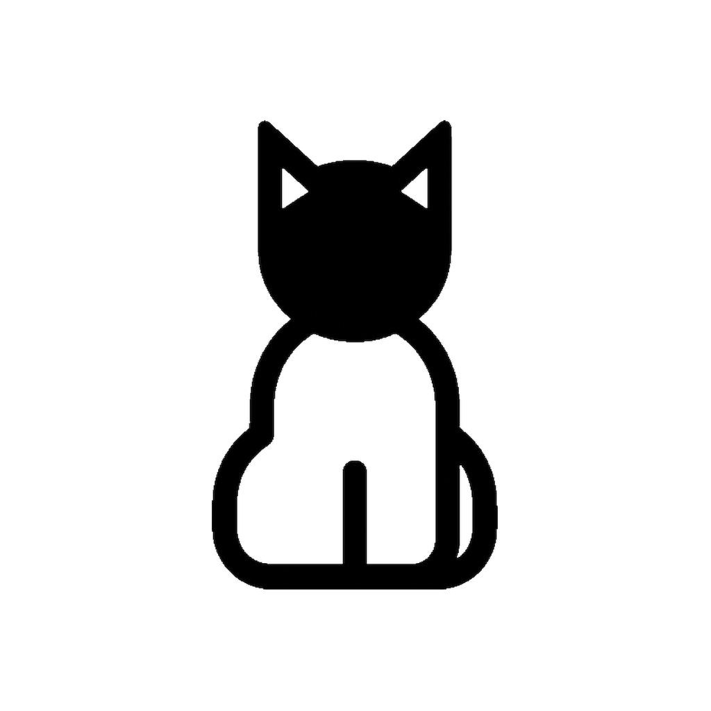

# 🐱 Luma - Focus Timer

**Luma** is a minimalist, high-performance focus timer designed for serious learners and developers. Built with **Rust (Tauri)** and **Vanilla JS**, it combines native performance with a beautiful, distraction-free "Dark Mode" UI.

## ✨ Features

### 🎯 Deep Focus Workflow
- **90-Minute Sessions**: Optimized for deep work cycles (based on ultradian rhythms).
- **Topic Tracking**: Forces you to declare your intention ("What are you studying?") before every session.
- **Distraction-Free**: Frameless, dark UI (Antigravity-style) that blends into your desktop.

### 🧠 Smart Tracking
- **Auto-Sleep Detection**: If your computer sleeps, Luma asks: "Did you take a break or keep working?" to keep your stats accurate.
- **Break Timer**: Counts *up* during breaks so you know exactly how long you've been away.
- **Completion Tracking**: Explicitly mark sessions as "Completed" or "Stopped Early" to track genuine productivity.

### 📊 Powerful Analytics
- **Dashboard**: A separate window for your stats.
- **Heatmaps & Streaks**: Visualize your daily consistency.
- **Session History**: Review exactly what you studied and for how long.

### ⚡ System Integration
- **Tray Persistence**: Closing the window minimizes to the menu bar.
- **Launch at Login**: Ready to go the moment you start your Mac.
- **Native Performance**: <10MB RAM usage thanks to the Rust backend.

---

## 🎓 Why Luma is Perfect for Learners

Learning requires **consistency** and **intentionality**. Luma creates a structure for both:

1.  **Intentional Starts**: You can't just click "Start". You have to type *what* you are learning (e.g., "Rust Ownership Rules"). This 5-second pause sets a mental anchor.
2.  **Guilt-Free Breaks**: The break timer counts UP. It doesn't shame you, but it keeps you aware of time passing.
3.  **Data-Driven Growth**: The Dashboard shows your "Daily Streak". Seeing that number grow is a powerful psychological hook to keep studying every day.
4.  **No Distractions**: The app visually disappears until you need it. No ads, no social features, just you and your work.

---

## 🛠️ Tech Stack

Built for speed and small footprint:
- **Core**: Rust (Tauri v2)
- **Frontend**: HTML5, CSS3, Vanilla JavaScript (No heavy frameworks)
- **Build**: Vite + TypeScript
- **State Management**: Finite State Machine (Idle -> Running -> Paused)

## 🚀 Installation

1.  Download the latest `.dmg` from the Releases page.
2.  Drag to `/Applications`.
3.  **Start Focusing.**

---

*Crafted with precision by Aamir Khan.*
